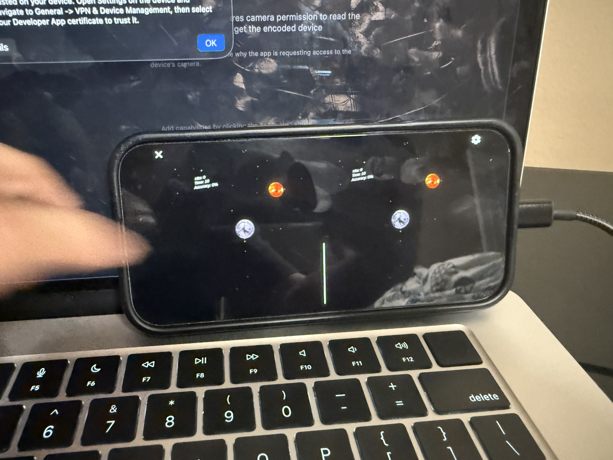

# Cardboard VR Aim Trainer

## What it is

A 30-second aim trainer for Google Cardboard. The player sees a glowing sun
floating in a starfield and fires moons at. Hits destroy the sun and spawn a new one nearby.
There is text tracking the hits, accuracy, and time which counts down. When time runs out you
can play again.

## Why this is a game

Juul's six features all apply here:

First there are fixed rules, there is one button that is aimed by head direction. There is also one target at a time and each game lasts 30 seconds. Next there is a variable, quantifiable outcome (hits and accuracy differ every round). There is also valorization of outcomes since hits are rewarded and misses aren't since misses cause your accuracy to go down. There is also player effort and the player is attached to the outcome. The score depends on how good a player's aim is as well as there reaction time, furthermore, the closing seconds creates pressure and the final accuracy/score is something the player wants to improve. Finally There is a negotiable consequance, since the player doesn't have to play again, basically playing again is optional.

Schell's definition fits too: "A game is a
problem-solving activity, approached with a playful attitude."

The problem resets every few seconds (can I hit the target before it moves, and can I beat my
last accuracy)

## Assets & inspiration

- Sun, Moon, and Milky Way textures: [Solar System Scope](https://www.solarsystemscope.com/textures/)
- Head tracking / stereo rendering: [Google Cardboard XR Plugin for Unity](https://github.com/googlevr/cardboard-xr-plugin)

## Photo

